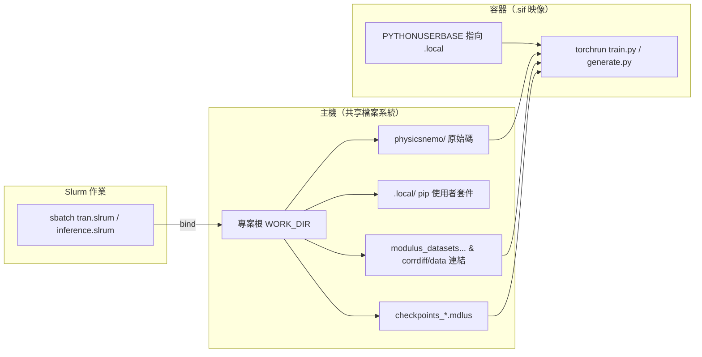

# AI-Powered Physics Bootcamp（CWA 工作區）

本目錄為 **CWA** 參加 **NVIDIA「AI-Powered Physics Bootcamp」** 時的**實作與實驗用工作目錄**；在 **CorrDiff**（天氣降尺度、迴歸＋擴散兩階段）的脈絡下，以 **HPC + Singularity/Apptainer 映像 + `physicsnemo` submodule** 跑通訓練與推論。

更細的模型與參數說明（官方 CorrDiff 歸檔）見：[`docs/CorrDiff-README.md`](docs/CorrDiff-README.md)。

### `WORK_DIR` 與 `sbatch` 怎麼用？

Slurm 作業腳本（`tran.slrum`、`inference.slrum`）裡的 **`WORK_DIR`** 代表專案**根目錄**（要含 `physicsnemo/`、`.sif`、執行 `tran_prep.sh` 後的 `.local/`）。

- **建議**：在專案根下提交，讓系統的 **`SLURM_SUBMIT_DIR`** 就是 repo 根，例如：  
  `cd /path/to/physicsnemo-corrdiff-lab && sbatch tran.slrum`
- **或**：在提交前手動 `export WORK_DIR=/絕對路徑/到/專案根` 再 `sbatch …`（適合從別處路徑呼叫腳本時）。

`bash tran_prep.sh` 會以**腳本所在目錄**當專案根（可選 `WORK_DIR=...` 覆寫）。請勿混用兩條路徑。

---

## 1. 整體在幹嘛

| 層次 | 內容 |
|------|------|
| **專案（此 repo 根目錄）** | 放 Slurm 腳本、講義、自己加的說明與小工具；**不**把幾十 GB 的 checkpoint／資料／`.sif` 納入 Git（見 `.gitignore`）。 |
| **程式庫** | [`physicsnemo/`](https://github.com/NVIDIA/physicsnemo) 以 **submodule** 掛在固定 upstream commit，實際範例在 `physicsnemo/examples/weather/corrdiff/`。 |
| **運算** | 在計算節點以 **`singularity exec --nv` + `--bind 專案根:專案根`** 進入 NGC 風格映像，讓容器看得到主機上的**程式碼、資料、checkpoint、寫在 `$WORK_DIR/.local` 的 pip 套件**。 |
| **CorrDiff 兩階段** | **Regression**：學一個**決定性**的粗→細映射（UNet）。**Diffusion**：在該迴歸基礎上做**隨機**超解析（擴散模型）。推論時需**兩者權重**＋**與訓練一致之資料/統計檔**＋**Hydra 產生設定**（時間點、ensemble 等）。 |

---

## 2. 運作邏輯（從主機到容器）

- **唯讀映像、可寫內容在 bind 出來的目錄**：因此不在映像內重複安裝一份巨大環境，而是**同一棵樹**給訓練/推論共用。
- **依賴安裝位置**：`bash tran_prep.sh` 在容器內把套件裝到 **`$WORK_DIR/.local`**；`tran.slrum` 與 `inference.slrum` 只設定同一路徑的 `PYTHONUSERBASE`（**作業內不再重跑 pip**；若沒有 `.local` 則作業直接失敗並提示先跑 `tran_prep.sh`）。
- **分散式 torch**：`tran.slrum` 內可設 `MASTER_ADDR=127.0.0.1`，避免部分環境在 `localhost` 上 c10d 綁定失敗；多卡時 `--nproc_per_node` 須與申請的 GPU 數一致。

---

## 3. 端對端手順（建議照序）

專案根目錄以下稱 `WORK_DIR`（見上節 `sbatch` 用法，**不要**在腳本裡寫死個人主機路徑）。

> **關於 `tran.slrum` 預設內容**：倉庫內**預設只啟用 Diffusion 訓練**（Regression 行為註解）。若你要**從零先訓練 regression**，請自行改註解：關掉 Diffusion 區、啟用 `config_training_hrrr_mini_regression`；待產生 checkpoint 後再切回擴散訓練，並讓 `REGRESSION_MODEL` 指到實際檔名。

| 步驟 | 做什麼 | 成功時你會有什麼 |
|------|--------|------------------|
| **0. Clone 與 submodule** | 取得本 repo 後：`git submodule update --init --recursive` | 出現有內容的 `physicsnemo/` |
| **1. 取得 HRRR-Mini 資料** | 依 [`docs/CorrDiff-README.md`](docs/CorrDiff-README.md) 用 NGC 下載，解壓到例如 `modulus_datasets-hrrr_mini_v1/` | 資料在磁碟、路徑你記下來 |
| **2. 連結到 corrdiff 的 `data/`** | 在 `WORK_DIR` 下建立 symlink，讓 `physicsnemo/examples/weather/corrdiff/data` 指到實際資料目錄（**指令摘要在 `docs/CorrDiff-README.md`**） | `train`/`generate` 的 `config_*` 內相對路徑能讀到 `.nc` / `stats.json` |
| **3. 準備或建置映像** | 將 `physicsnemo_25.11.sif` 放在 `WORK_DIR`；若自行建置見 `scripts/build-physicsnemo-sif.sh` | 與 Slurm 腳本內的 `.sif` 路徑一致 |
| **4. 安裝 Python 依賴（只須在訓練/推論前執行或更新）** | 在 **login 或互動（通常無 GPU 即可）** 執行：`bash tran_prep.sh`；可選與訓練同樣帶 NV：`USE_SINGULARITY_NV=1 bash tran_prep.sh` | `WORK_DIR/.local` 內有 `pip install` 的 `physicsnemo` 與 corrdiff `requirements.txt` |
| **5. 訓練－Regression** | 編輯 `tran.slrum`：啟用 **Regression** 的 `torchrun ... config_training_hrrr_mini_regression.yaml`，**關掉** Diffusion 區；檢查 `#SBATCH` 資源；`sbatch tran.slrum` | `checkpoints_regression/*.mdlus` 等產生 |
| **6. 訓練－Diffusion** | 把 `REGRESSION_MODEL=` 指到上一步的 `.mdlus`；啟用 **Diffusion** 的 `torchrun ... config_training_hrrr_mini_diffusion.yaml`；`sbatch tran.slrum` | `checkpoints_diffusion/`，常見如 `EDMPrecondSuperResolution.*.mdlus`（以實際寫出為準） |
| **7. 推論** | 在 `inference.slrum` 設定 `REGRESSION_MODEL`、`DIFFUSION_MODEL`；依需求改 `config_generate_hrrr_mini.yaml` 的時間點/資料路徑；`sbatch inference.slrum` | 預設產生 `corrdiff_output.nc`，並執行 `score_samples.py` 產生 `score_output.nc`（檔名依設定為準） |
| **8. 查 log** | 看專案根目錄 `corrdiff_<JobID>.log` | 確認 loss、權重載入、路徑錯誤等 |

**相依鏈（邏輯上不能跳）：**  
Regression checkpoint → 作為條件訓練 Diffusion；Regression + Diffusion → `generate.py`；`generate` 的 NetCDF →（可選）`score_samples.py`。

**本機開發（不經映像）**：可只用 `uv` 裝在 submodule 內，見 `scripts/install-physicsnemo-uv.sh`；HPC 排程仍建議以映像＋`tran_prep.sh` 路徑為準。

---

## 4. 各腳本職責一覽

| 檔案 | 職責 |
|------|------|
| [`tran_prep.sh`](tran_prep.sh) | 在**非** Slurm 或登入節點、用**同一** `.sif` 與 bind，把 `pip` 寫入 `$WORK_DIR/.local`；**訓練作業不應依賴此時再裝**（`tran.slrum` 已不內建 pip）。 |
| [`tran.slrum`](tran.slrum) | Slurm 上 `torchrun` **訓練**；需**事先** `bash tran_prep.sh`；內建 `MASTER_ADDR=127.0.0.1`；`sbatch` 前請在專案根或設好 `WORK_DIR`。 |
| [`inference.slrum`](inference.slrum) | `torchrun generate.py` + `score_samples.py`；同樣依賴**事先**的 `tran_prep.sh`，**不**在作業內重跑 `pip`。 |
| `scripts/build-physicsnemo-sif.sh` | 從 NGC 映像轉出 `.sif`（大檔、勿提交 Git）。 |
| `scripts/install-physicsnemo-uv.sh` | 在 submodule 內以 `uv sync` 安裝（本機開發用）。 |

---

## 5. 訓練腳本（`tran.slrum`）還要準備什麼？

不是只有 `.sif`。至少需同時滿足：

- 映像路徑正確、GPU 相關的 `#SBATCH` 與實際叢集一致。
- `physicsnemo/` 存在且為你預期版本（submodule）。
- **`WORK_DIR/.local` 已完成依賴安裝**（`bash tran_prep.sh`）。
- 訓練用 `config_*.yaml` 與 **symlink 後的資料** 路徑一致。
- 訓練 **Diffusion** 時，**Regression** checkpoint 路徑必須存在且與變數 `REGRESSION_MODEL` 相同。

---

## 6. 推論腳本（`inference.slrum`）的 input 是什麼？

`generate.py` 使用 Hydra 設定檔 **`config_generate_hrrr_mini.yaml`**，並在命令列覆寫兩個 checkpoint。

| 類型 | 含義 | 在範例中怎麼給 |
|------|------|----------------|
| **模型權重** | Regression / Diffusion 的 `.mdlus` | 腳本內 `REGRESSION_MODEL`、`DIFFUSION_MODEL` → 對應 `++generation.io.reg_ckpt_filename`、`res_ckpt_filename` |
| **氣象 NetCDF** | 讀入的資料檔 | `config_generate_hrrr_mini.yaml` 內 `dataset.data_path`（預設相對路徑 `./data/hrrr_mini/...`；常靠步驟 2 的 symlink 指到實際資料） |
| **stats** | 與訓練一致的統計檔 | `dataset.stats_path`（同上，常為 `./data/hrrr_mini/stats.json`） |
| **產生條件** | 要產生的**時間、ensemble 等** | 同檔內 `generation.times`、`num_ensembles` 等 |
| **評分** | 將 `generate` 輸出再跑 metrics | 範例為 `python score_samples.py corrdiff_output.nc score_output.nc`（`generate` 預設輸出名可為 `corrdiff_output.nc`，可於設定中改 `generation.io.output_filename`） |

完整欄位以子目錄內配置為準：  
[`physicsnemo/examples/weather/corrdiff/conf/config_generate_hrrr_mini.yaml`](physicsnemo/examples/weather/corrdiff/conf/config_generate_hrrr_mini.yaml)。

---

## 7. 目錄說明

| 內容 | 說明 |
|------|------|
| `physicsnemo/` | [NVIDIA PhysicsNeMo](https://github.com/NVIDIA/physicsnemo) **submodule**；`git submodule update --init --recursive`；checkpoint 等巨檔不進上層 Git。 |
| `modulus_datasets-hrrr_mini_v1/` | HRRR-Mini 資料常放此名（大、已 ignore）。 |
| `physicsnemo_25.11.sif` | 容器映像（已 ignore）。 |
| `.local/` | `pip --user` 與 `PYTHONUSERBASE`（已 ignore）。 |
| `Day*.pdf` | 營隊講義。 |
| `docs/CorrDiff-README.md` | CorrDiff 歸檔與 NGC/指令摘要。 |
| 根目錄 `corrdiff_*.log` | Slurm 標準輸出日誌（已 ignore）。 |

---

## 8. 版控策略（此根目錄 repo）

- **追蹤**：腳本、講義、`docs/` 自寫補充、`README`、`.gitignore`、**`physicsnemo` submodule 指針**（`.gitmodules`）。
- **不追蹤**：映像、資料集、`.local`、日誌、大型產出（見 `.gitignore`）。子模組**內**的修改在上游 repo 內以 Git 管理；若要固定到父專案，在子目錄 commit 後回父層 `git add physicsnemo` 再 push。
